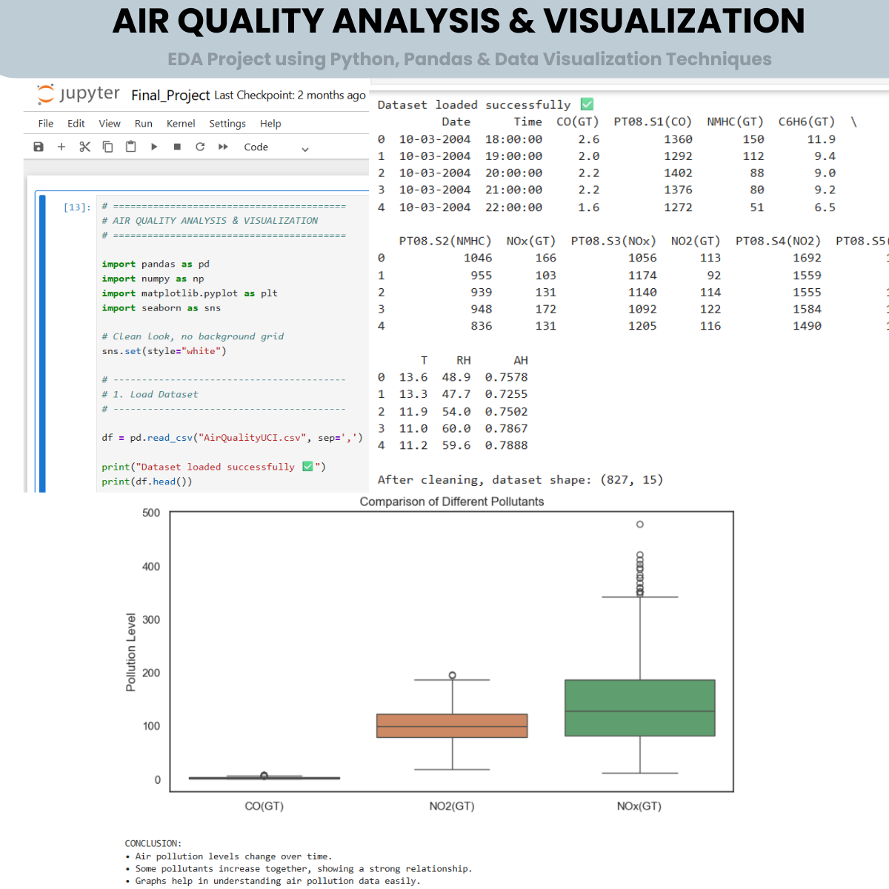

# 🚀 Air Quality Analysis & Visualization

A data analysis and visualization project focused on understanding air pollution patterns using Python and data science libraries.

## 📌 About This Project
This repository contains:
- Air quality dataset analysis
- Data cleaning and preprocessing
- Exploratory Data Analysis (EDA)
- Pollution trend visualization
- Statistical insights and comparisons
- Beginner-friendly data science workflow

## 📂 Files Included
- `Final_Project.ipynb` → Jupyter Notebook containing complete air quality analysis
- `AirQualityUCI.csv` → Dataset used for analysis
- `EDA Project using Python, Pandas & Data Visualization Techniques.png` → Project output screenshot

## 🛠 Technologies Used
- Python
- Pandas
- NumPy
- Matplotlib
- Seaborn
- Jupyter Notebook

## 🎯 Learning Goals
This project helps in understanding:
- Exploratory Data Analysis (EDA)
- Data cleaning techniques
- Data visualization concepts
- Pollution data interpretation
- Real-world data science workflow

## 📸 Project Output

## 👨‍💻 Author
**Yashraj Sharma**

---
⭐ If you like this project, don't forget to star the repository.
